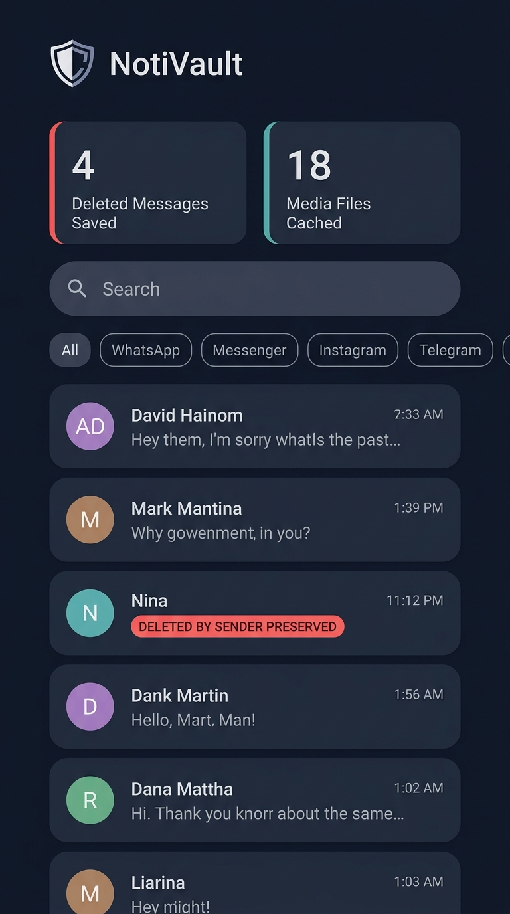

# NotiVault 🛡️

**Open-Source Android Notification History, Deleted Message Recovery & Media Backup Vault**

[](https://kotlinlang.org)
[-3DDC84.svg?logo=android)](https://developer.android.com)
[](https://developer.android.com/jetpack/compose)
[-009688.svg)](https://developer.android.com/training/data-storage/room)
[-success.svg)](https://github.com)
[](LICENSE)

---

## 🌟 Overview

**NotiVault** is an enterprise-grade, privacy-first Android application designed to reliably log incoming notifications, recover deleted or unsent messages across popular chat platforms (WhatsApp, Messenger, Instagram Direct, Telegram), and automatically back up downloaded media attachments to internal protected storage before senders can delete them.

Unlike commercial notification loggers that track telemetry or upload your personal conversations to cloud analytics servers, **NotiVault contains zero internet permissions (`android.permission.INTERNET` is strictly omitted from the manifest)**. All data stays 100% offline on your device, protected by local biometric authentication.

<p align="center">
  
</p>

---

## ✨ Key Features

- **🔔 Robust Notification Interception**:
  - Leverages Android's native `NotificationListenerService`.
  - Parses `NotificationCompat.MessagingStyle` bundles to extract multi-message conversations, contact avatars, senders, and timestamps.
  - Pre-configured support for **WhatsApp**, **Facebook Messenger**, **Instagram Direct**, and **Telegram**, with automatic discovery for any messaging app.

- **🗑️ Deleted Message Recovery & Detection**:
  - Automatically identifies message revocation events (*"This message was deleted"*, *"You unsent a message"*, etc.) across English, Spanish, Portuguese, French, German, Bengali, and Hindi.
  - Correlates revocation alerts with previously saved active messages in the chat thread.
  - Retains the **original message text** permanently, marking it with a prominent `DELETED BY SENDER • PRESERVED` badge and timestamp.

- **📷 Media Observer & Early Caching Engine**:
  - Employs a dual-layer media observer (`MediaStoreObserver` via `ContentObserver` and `MediaFileObserver` via inotify).
  - Automatically copies incoming photos, videos, audio notes, and documents to NotiVault's protected internal storage before sender "Delete for Everyone" commands can erase them from shared storage.
  - Built-in media gallery with filter chips (All, Photos, Videos, Audio) and fullscreen preview dialog.

- **🔒 Zero-Network Privacy & Local Biometrics**:
  - **No Internet Access**: NotiVault cannot communicate over Wi-Fi or cellular networks.
  - **Biometric App Lock**: Integrated with AndroidX `BiometricPrompt` supporting fingerprint, facial recognition, and device PIN/Pattern.
  - **Window Protection (`FLAG_SECURE`)**: Prevents background screen recording and masks contents in the Android Recents app switcher.

- **📤 Data Export & Management**:
  - Export chat history and deleted message logs to structured **JSON** or RFC 4180 **CSV**.
  - Locally share or backup exports via secure Android `FileProvider`.
  - Granular data management: clear individual messages, wipe deleted logs, or perform a total factory reset.

---

## 📐 Architecture & System Design

NotiVault is engineered following **Clean Architecture** and **MVVM** design principles with reactive Kotlin Coroutine `Flow` streams:

```
┌─────────────────────────────────────────────────────────────┐
│                       UI Layer (M3)                         │
│  HomeScreen  •  ChatDetailScreen  •  MediaGallery  •  Setup │
└──────────────────────────────▲──────────────────────────────┘
                               │ StateFlow / Actions
┌──────────────────────────────┴─────────────────────────────┐
│                     ViewModel Layer                        │
│   HomeViewModel  •  ChatDetailViewModel  •  MediaViewModel  │
└──────────────────────────────▲─────────────────────────────┘
                               │ Repository interfaces
┌──────────────────────────────┴─────────────────────────────┐
│                    Repository Layer                        │
│   MessageRepository  •  MediaRepository  •  SettingsRepo   │
└──────────────────▲───────────────────────────▲─────────────┘
                   │                           │
┌──────────────────┴───────────────┐ ┌─────────┴─────────────┐
│       Background Services        │ │     Local Room DB     │
│ - NotiVaultListenerService       │ │ - AppEntity           │
│ - NotificationParser             │ │ - ChatThreadEntity    │
│ - DeletedMessageDetector         │ │ - MessageEntity       │
│ - MediaObserverService           │ │ - MediaEntity         │
└──────────────────────────────────┘ └───────────────────────┘
```

For complete technical specifications, see [docs/ARCHITECTURE.md](docs/ARCHITECTURE.md).

---

## 🔍 The "View-Once" & Ephemeral Media Architecture

Many users wonder: *Can an unprivileged Android application capture "View-Once" photos or videos from WhatsApp or Instagram?*

NotiVault includes an authoritative technical engineering whitepaper explaining why **operating system cryptographic boundaries and Linux sandboxing (`FLAG_SECURE` + UID isolation)** protect view-once media from third-party interception, and how safe tools differ from dangerous modded APKs (GBWhatsApp, LSPosed modules) that cause account bans.

👉 **Read the complete whitepaper**: [docs/EPHEMERAL_MEDIA_ARCHITECTURE.md](docs/EPHEMERAL_MEDIA_ARCHITECTURE.md)

---

## 📁 Repository Structure

```
.
├── .gitignore
├── build.gradle.kts                # Root Gradle build configuration
├── settings.gradle.kts             # Gradle project settings
├── gradle.properties               # Build & JVM properties
├── gradlew / gradlew.bat           # Gradle wrapper execution scripts
├── gradle/
│   ├── libs.versions.toml          # Centralized dependency catalog
│   └── wrapper/                    # Gradle distribution binaries
├── docs/
│   ├── ARCHITECTURE.md             # In-depth architectural specifications
│   ├── EPHEMERAL_MEDIA_ARCHITECTURE.md # Analysis of ephemeral media & sandboxing
│   └── PERMISSIONS_GUIDE.md        # User setup and troubleshooting guide
├── scripts/
│   └── verify_algorithms.py        # Independent verification test suite
└── app/
    ├── build.gradle.kts            # App module dependencies & plugins
    ├── proguard-rules.pro          # ProGuard rules for Room & Compose
    └── src/
        ├── main/
        │   ├── AndroidManifest.xml # Zero-internet manifest declaration
        │   ├── res/                # M3 theme, drawables, XML file paths
        │   └── java/com/notivault/app/
        │       ├── NotiVaultApp.kt
        │       ├── data/local/     # Room DB, Entities, DAOs, Converters
        │       ├── data/repository/# Clean repositories & implementations
        │       ├── service/        # Notification listener, parser, media observer
        │       ├── security/       # BiometricAuthManager & SecurityPreferences
        │       ├── export/         # JSON & RFC 4180 CSV DataExporter
        │       └── ui/             # Jetpack Compose screens, M3 themes, NavGraph
        └── test/                   # JUnit 4 & Coroutine unit test suites
```

---

## 🛠️ Build & Installation

### Prerequisites
- Android Studio Ladybug (2024.2+) or IntelliJ IDEA
- JDK 17+
- Android SDK Platform 34 (Android 14)

### Building via Terminal
1. Clone the repository:
   ```bash
   git clone https://github.com/your-username/notivault.git
   cd notivault
   ```
2. Build debug APK:
   ```bash
   ./gradlew assembleDebug
   ```
3. Run unit test suites:
   ```bash
   ./gradlew test
   ```
4. Output APK location:
   ```
   app/build/outputs/apk/debug/app-debug.apk
   ```

---

## 🛡️ Privacy & Security Model

1. **Zero-Network Manifest**: `android.permission.INTERNET` is omitted. NotiVault has no network sockets, DNS resolvers, or HTTP clients.
2. **Encrypted Storage**: The database and cached media reside exclusively within the application's internal data directory (`/data/user/0/com.notivault.app/`).
3. **Local Biometric Challenge**: When enabled, the app cannot be opened without biometric authentication.
4. **Open-Source & Auditable**: Every line of code is open for review.

---

## 📄 License

Licensed under the Apache License, Version 2.0. See [LICENSE](LICENSE) for details.
